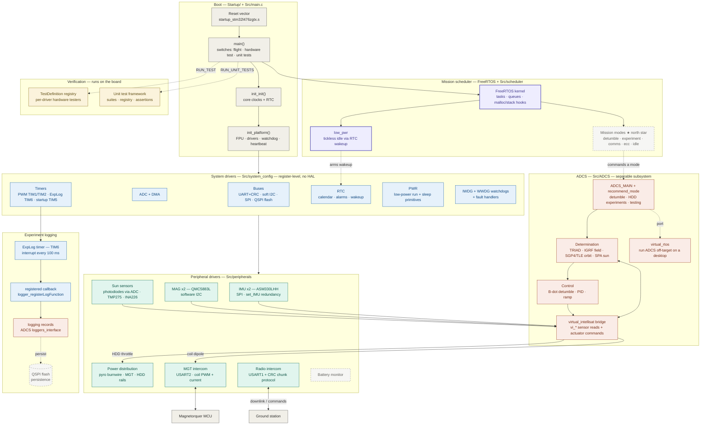

# IntelliSat — system design

> How a reset vector becomes a **mission**.
>
> IntelliSat is the flight software for REALOP-1, a 3U CubeSat built by Space
> and Satellite Systems at UC Davis. It runs on the Orbital Platform flight
> computer (STM32L476ZG, ARM Cortex-M4F) with no vendor HAL — every driver
> talks to hardware registers directly. On boot it brings up clocks, buses,
> sensors, and watchdogs, then hands control to a FreeRTOS scheduler whose
> mission modes call into a fully separable ADCS subsystem. The **north star**
> is the autonomous mission loop — the scheduler picks a mode, ADCS points the
> satellite, the 100 ms logger records the experiment, and the radio downlinks
> it to the ground.

This document is the developer-facing map of the whole system — every
component, **built or planned**, and how data moves between them. Read the
flowchart top-to-bottom; the dashed nodes are the roadmap.

---

## End-to-end flowchart

**Legend** — ⬜ boot / external · 🟦 system drivers (register-level) ·
🟩 peripherals · 🟪 FreeRTOS scheduler · 🟧 ADCS · 🟨 on-target verification ·
◌ dashed = planned / scaffolded (not yet flight logic).

---

## How to read it: the three flows that matter

1. **Two headers decouple the flight software from ADCS.** `ADCS.h` is the
   downcall — a scheduler mode commands `ADCS_MAIN(mode)` and blocks until it
   returns a status. `virtual_intellisat.h` is the upcall — ADCS reads sensors
   and commands actuators *only* through `vi_*` functions that IntelliSat
   implements. ADCS never touches a hardware register, so the same control
   code builds and runs off-target through `virtual_rtos` for development
   without a board.
2. **The experiment logger is a callback, not a subsystem** (the
   `TIM6 → callback` edge). TIM6 fires an interrupt every 100 ms; whatever an
   experiment needs recorded is bound at runtime with
   `logger_registerLogFunction()`, and the ISR dispatches it. Timer hardware
   stays decoupled from application logic, and the sampling cadence holds no
   matter what the RTOS is doing.
3. **Redundancy and board revisions are gates, not forks.** The `OP_REV` macro
   selects pin maps and bus assignments per Orbital Platform revision at
   compile time. On Rev 3 the platform carries two IMUs on separate SPI buses
   and two magnetometers — `set_IMU()` retargets every driver call between
   IMU0 and IMU1 at runtime, so a failed sensor is a switch, not a mission
   loss.

The **★ mission modes** node is the north star. The diagram makes the
punchline visible: everything upstream already exists to feed it — drivers,
scheduler, ADCS algorithms, and the logger are built; the mode tasks
(`*_time` / `config_*` / `run_*` / `clean_*`) are scaffolded and waiting for
flight logic.

---

## Component inventory

| Component | Layer | Tech | Status | Where |
|---|---|---|---|---|
| Startup + linker scripts | Boot | ARM asm · LD | ✅ built | `Startup/`, `STM32L476ZGTX_*.ld` |
| Clock tree + core config | System | C (registers) | ✅ built | `Src/system_config/core_config.c` |
| GPIO + EXTI interrupts | System | C (registers) | ✅ built | `Src/system_config/GPIO/` |
| UART + CRC | System | C (registers) | ✅ built | `Src/system_config/UART/` |
| Software I2C (bit-bang) | System | C (registers) | ✅ built | `Src/system_config/I2C/` |
| SPI | System | C (registers) | ✅ built | `Src/system_config/SPI/` |
| QSPI flash driver | System | C (registers) | ✅ built | `Src/system_config/QSPI/` |
| ADC + DMA | System | C (registers) | ✅ built | `Src/system_config/ADC/`, `DMA/` |
| RTC (calendar, alarms) | System | C (registers) | ✅ built | `Src/system_config/RTC/` |
| PWM timers | System | C (registers) | ✅ built | `Src/system_config/Timers/pwm_timer.c` |
| Experiment log timer (TIM6 + callback) | System | C (registers) | ✅ built | `Src/system_config/Timers/logger_timer.c` |
| Startup wait timer (TIM5, 30 min) | System | C (registers) | ✅ built | `Src/system_config/Timers/startup_timer.c` |
| Watchdogs (IWDG + WWDG) | System | C (registers) | ✅ built | `Src/system_config/WDG/` |
| Fault handlers | System | C (registers) | ✅ built | `Src/system_config/Faults/` |
| Low-power run + sleep | System | C (registers) | ✅ built | `Src/system_config/PWR/` |
| Dual IMU driver (ASM330LHH) | Peripheral | C · SPI | ✅ built | `Src/peripherals/IMU/` |
| Magnetometer driver (QMC5883L) | Peripheral | C · I2C | ✅ built | `Src/peripherals/MAG/` |
| Sun sensors (diodes + TMP275 + INA226) | Peripheral | C · ADC/I2C | ✅ built | `Src/peripherals/SunSensors/`, `PWRMON/` |
| Power distribution (pyro / MGT / HDD) | Peripheral | C · GPIO | ✅ built | `Src/peripherals/PDB/` |
| MGT intercom | Peripheral | C · UART | ✅ built | `Src/peripherals/MGTINTERCOM/` |
| Radio intercom | Peripheral | C · UART+CRC | 🟡 protocol defined | `Src/peripherals/Radio/` |
| Battery monitor | Peripheral | C · ADC | ⬜ planned (stubbed) | `Src/peripherals/BAT/` |
| FreeRTOS kernel + hooks | Scheduler | FreeRTOS | ✅ built | `FreeRTOS/`, `Src/scheduler/hooks/` |
| Tickless low-power idle | Scheduler | FreeRTOS + RTC | ✅ built | `Src/scheduler/intelliTasks/low_pwr.c` |
| Mission mode tasks | Scheduler | FreeRTOS | ⬜ scaffolded | `Src/scheduler/intelliTasks/` |
| Flight main loop | Scheduler | C | 🟡 boots, logic pending | `Src/main.c` |
| ADCS math (vector · matrix · quaternion) | ADCS | C | ✅ built | `Src/ADCS/adcs_math/` |
| Attitude determination (TRIAD + models) | ADCS | C · IGRF/SGP4/SPA/NOVAS | ✅ built | `Src/ADCS/determination/` |
| Attitude control (B-dot · PID · ramp) | ADCS | C | ✅ built | `Src/ADCS/control/` |
| `virtual_intellisat` bridge | ADCS | C headers | 🟡 interface fixed, impls pending | `Src/ADCS/virtual_intellisat.h` |
| On-target unit test framework | Verification | C | ✅ built (IMU suite) | `Src/unit_tests/` |
| Per-driver hardware testers | Verification | C | ✅ built | `*_tester.c`, `*_test.c` |

> Mission mode tasks follow a fixed contract — `*_time()` (should it run?),
> `config_*`, `run_*`, `clean_*` — declared in
> `Src/scheduler/intelliTasks/intelliTasks_proto.h`. The pattern is in place;
> the bodies are stubs awaiting flight logic.

---

## Repository layout

| Path | Role |
|---|---|
| `Src/system_config/` | Register-level MCU drivers: clocks, buses, timers, RTC, power, watchdogs, faults |
| `Src/peripherals/` | Sensor / actuator / intercom drivers built on the system layer |
| `Src/scheduler/` | FreeRTOS mission scheduler: mode tasks, kernel hooks, tickless idle |
| `Src/ADCS/` | Attitude determination & control — separable subsystem with its own math and third-party models |
| `Src/unit_tests/` | On-target unit test framework (suites, registry, assertions) |
| `Src/tools/` | `printMsg` debug print/scan over the debug UART |
| `FreeRTOS/`, `Drivers/` | Vendored FreeRTOS kernel and CMSIS / STM32L4 device headers |
| `Startup/`, `*.ld` | Cortex-M4 reset vector and FLASH/RAM linker scripts |
| `Manuals/`, `img/` | Onboarding, toolchain, and hardware documentation |

---

## Bring-up stages

The build follows the classic firmware bring-up ladder (Stage 0 board
bring-up → Stage 8 flight readiness):

| Stage | Name | Status |
|---|---|---|
| 0 | Board bring-up — clocks, GPIO, debug UART | ✅ done |
| 1 | Bus + storage drivers — I2C, SPI, QSPI, ADC+DMA | ✅ done |
| 2 | Sensor + actuator peripherals — dual IMU, mag, sun sensors, PDB | ✅ done |
| 3 | Timekeeping + protection — RTC, timers, watchdogs, fault handlers | ✅ done |
| 4 | RTOS integration — kernel, hooks, tickless low-power idle | 🟡 queue/task demos; heap tuning in progress |
| 5 | Mission scheduler — mode tasks with time/config/run/clean contract | ⬜ scaffolded, bodies pending |
| 6 | ADCS integration — algorithms built, `vi_*` bridge implementations | 🟡 in progress |
| 7 | Comms — radio + magnetorquer intercom protocols, ground loop | 🟡 protocols defined |
| 8 | Flight readiness — antenna burnwire, flash logging, boot counters | ⬜ not started |
